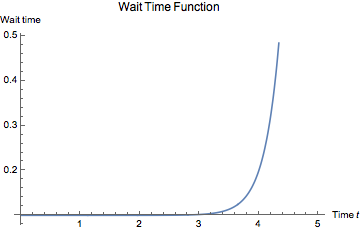

# Project: Dice

### Difficulty level: Easy

</img>

## Description
In this project you'll be creating dice for the classic board game _Snakes and Ladders_
on the Sense HAT.

The aim is to shake the raspberry pi get a random number between 1 and 6 displayed on the screen.
## Project Manual

This project guide will tell you step-by-step the main things you have to do
in order to create the _Dice_. For some of the steps, you'll have to figure out
how to proceed yourself, good luck!

### Introducing the project

The first thing you have to do is open the file you'll be programming in. In the
_Dice_ project folder, open the file called _dice.py_. The code in this file
is not enough to actually run Dice, you'll have to fill in the blanks! In
programming, we call this _skeleton code_.

As you might see, the skeleton code is split up into sections, divided by the headlines.
For example:

    #### 2. Code section

When you set about your task you should let these headlines guide you on what to
do in each part of the code. The next part of this guide will explain the stuff that's
already in the skeleton code when you first open it.

Note: The text starting with a '#' is called a comment. These comments explain what the code does
to programmers and people reading the code, but is ignored by the computer.

##### Coding in Trinket

You should write and develop your code on the website <a href="https://trinket.io/">https://trinket.io/</a>.
There, you'll be able to test your code on a *virtual* Sense HAT, before you try
your code on the real thing. Go on to the website, and create an account.

You should copy all of the code in *dice.py*, as well as the other files in the project
folder, on to a new Trinket project.

##### Explanation of the skeleton code

The first few lines in the script are:

    #### 1.1 Import libraries

    import sys
    sys.path.insert(1,'/home/pi/Go4Code/g4cSense/skeleton')
    sys.path.insert(1,'/home/pi/Go4Code/g4cSense/graphics')

    from sense_hat import SenseHat
    from senseGraphics import *
    from senselib import *
    import random
    import time

Without going into detail, these lines are called *import statements*. They are
used to *import* code from other Python files into your own file. This is useful
because you can use other people's code to simplify your own.

The next part of the code (Sec. 1.2) creates some important *Objects* (don't worry
if you're not sure what that means) that we'll use in the later on.

Sec. 1.3 is where the initial variables of the project are set up.
You'll need to fill in the lists to customise your project.

Sec. 2 and 3 are where all the main coding will take place. This is the*Main Loop*

Sec. 2 is where we check if the raspberry pi has been shaken.

Sec. 3 is where we display random numbers on the screen.

---

#
### Writing the code

##### (Sec. 1.3) Set up the variables

In this section we have some definitions of variables that we'll use in the code
later on.

The colour in which the numbers will be displayed needs to be defined here in *RGB* format.As you might remember, in programming a color is usually represented as *three* numbers *[r, g, b]*. The numbers in the square brackets specify how much red (*r*), green (*g*) and blue (*b*) .By mixing different amounts of red, green and blue light, we can make almost any colour. The amount of red, green or blue you can put in to make a colour goes from 0 to 255. For example,
orange is made by mixing 255 red, 127 green and 80 blue. In code this would look like this:

    #This will set the colour variable to a combination of RGB that gives orange
    colour = [255,127,80]

The next variable is *numbers*. This variable simply contains a list of numbers that the dice can possibly give out. If we had a special dice with 5 faces that could give numbers between 4 and 9, the possible numbers would be given like this:

    numbers_on_dice = ['5','6','7','8','9']

##### (Sec 1.4) Display a Message

To tell the user that the Raspberry Pi is ready to show some dice, we should display a message. 

Add a line of code that will display the words "Dice!" in any colour you want. 

##### (Sec. 2) Main program code

Before we start coding, we'll explain a bit what's going on in Sec. 2.

In this part of the code, we'll do all the main programming.
If we look at the skeleton code, we see that the section is within a *while*-loop.
Remember that code inside a while loop runs again and again, until we tell it to
stop. The reason why we want our program to be in a loop is because we want
to continually check if the user has shaken the device.

Because the code is in the *while*-loop, remember that you have to add
a *Tab* at every line, to make it indented. The indentation tells the computer what is inside the*while*-loop. Like this:

    while True:
        # write your code like this,
        # with a tab at the start of the line.

##### (Sec 2.1) Calculate and check if the Sense Hat is been shaken.

**This part is a bit complicated, so pay attention! Don't be afraid to ask a supervisor if you don't understand something.**

To see if the user has shaken the Sense HAT, we'll have to use the *accelerometer* inside the device. Acceleration is just the rate at which the speed of something changes. The accelerometer basically tells us how fast the device has been accelerating.

To get the information from the accelerometer, use the following code:

    ac = sense.get_accelerometer_raw()
    x = ac["x"]
    y = ac["y"]
    z = ac["z"]

Now, in the *x*, *y* and *z* variables, we have information recorded by
the accelerometer. This is all a bit complicated, but the basic gist of it
is this, calculate this:

    shake = x*x + y*y + z*z

We have stored *x times x plus y times y plus z times z* into the variable *shake*. Now, the larger the variable *shake* is, the more has the Sense HAT been shaken.
We're going to say that if *shake* is *larger* than *5*, the Sense HAT has been shaken. To do this, you're going to have to use an *if*-statement.

If you have detected that the Sense HAT has been shaken (in other words, if
*shake* is larger than 5) you want to start displaying the numbers. This will be done in another *while* loop as explained in the next section.

#### (Sec 3) Displaying numbers on the screen.

Programming has two parts to it. First understanding the problem and finding a step by step way to solving it ***(The Algorithm)*** and then telling the computer that solution in the language it can understand ***(The code)***

##### Understanding the Algorithm
In the dice we are trying to make, the Sense Hat changes the number on the screen after a time interval for 5 seconds. As the we get closer the 5 seconds the time interval starts getting bigger. If we were to have a timeline of the events happening on the SenseHat it would look like this:

</img>

The coloured vertical lines represent an event i.e. the number on the display screen changing. Near the start, these changes happen very quickly! But as we get closer to the finish, the time step starts increasing and the numbers start slowing down on the SenseHat.

- At each vertical line, the Raspberry Pi randomly selects a number from the choice of possible numbers we specified earlier.
- Then displays this number on the screen in whatever colour we give.
- After that it waits until it is time to change the colour again.
- It then increases the time between events.

This continues in a *loop* until the time between events is greater than 1 second. After this we get the final number.

##### The Code

Now that we hopefully understand how to solve the problem, having broken it down a bit. Let's fill in the sections and code the solution!

We have first *initialised* some variables that are used to control the dice.

      #### Set Dice Variables
      time_between_changes = 0.01 #This is the minimum time between events.
      start = time.time() #This line makes the Raspberry Pi note the start of the dice roll.

The next variable we must define is the *run time* which is the amount of time (in seconds) that the Sense Hat will show random numbers before stopping at a final one.

The next line starts the*while* loop.

##### (Sec 3.1) Randomly selecting a number

In*Python,* random selection from a list is actually really easy. The code below demonstrates how we can randomly select from a list.

      list = ['a','b','c',d]
      random_letter = random.choice(list)

If you were to run that code and print the *random_letter* variable, you would get a letter randomly selected from the list given above.

Now figure out how to randomly select a number and show it on the screen. To show characters on the screen use the function *sense.show_letter()*. Have a look at code below:

      yellow = [255,255,0] ## Yellow is made of 255 red and 255 green.
      blue = [0,0,255]
      sense.show_letter('8', text_colour = yellow, back_colour = blue)

The first two lines define the colours yellow and blue in *[r,g,b]* format. The next line shows the character '8' on the Sense Hat's screen with the text colour in yellow and the back colour in blue.

##### (Sec 3.2) Waiting to change the number

Here we make the Pi wait until it is time to select a new number. This is the time between events.

To a program wait for a certain amount of time, we simply tell it to sleep! The code below tells the program to sleep for a given number of seconds:

    sleepTime = 2
    time.sleep(sleepTime)

This will make the program wait 2 seconds before moving on to the next line of code. Use this to implement the time interval between the changing of numbers.

##### Increasing the wait time
**Reading this is optional**

The time step between the changing of numbers increases very slowly right until we get close to the end of the run time. This is done by increasing the time step by almost nothing and then suddenly increasing it nearer to the end time. This means that as we get closer to the end time the rate at which the numbers change starts going down because the wait time increases. Right up until it is bigger than a second, which is when the loop stops! This is what the time step looks like in graphical form.

</img>

We have implemented this in the background using some clever mathematics!

##### (Sec 3.3) Showing the final number

Pick a text and back colour and show the user the final number!

After this Raspberry Pi will go back back to the top of the *Main*-loop and start checking for a shake again.

If everything went well, you will have made dice! If you want, try implementing some of the features suggested below.

#### Additional features
**These are optional**

In this section we suggest some additional features you could implement on your project. We encourage you to come up with your own features that you can implement with the help of the supervisors.

  - Display the numbers in random colours. *Hint:* Use the randomColour() function.
  - Make the amount of time the dice runs for increase with how much you shake it. *Hint:* Make sure not to let it run forever!
  - Make the final number blink. *Hint* You will need another loop.

Ask your group mentor for help if you have an idea!

#### End

---
Author: Ishan Khurana
Date:   August 09, 2017
Copyright (c) 2017 Go4Code All Rights Reserved.
---
