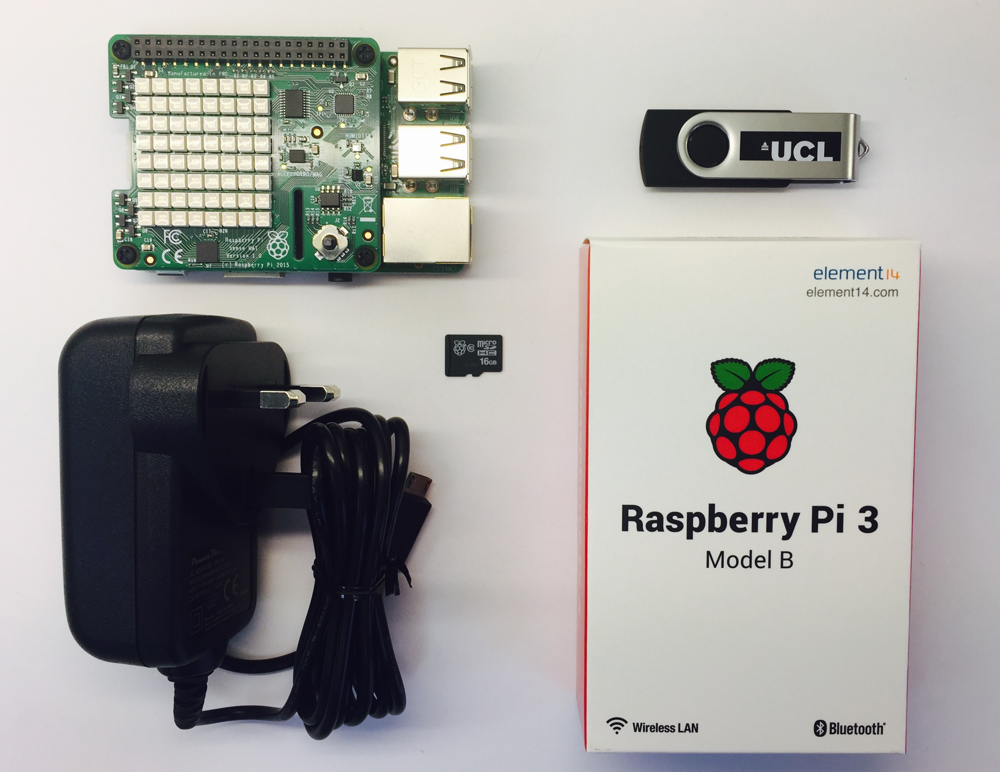

<h1>

</h1>

<h2>
Go4Code Summer School    Student Guide     
 </h2>

Welcome to the UCL Go4Code Summer School. You have all been given a Raspberry Pi and a Sense HAT. During your three days at UCL you will be programming your Raspberry Pi in *python* to control the Sense HAT.

We have prepared some projects for you to work on and once you get comfortable with coding you can design your own projects! All the material is on our website which is open on the computers in front of you and you can access this from anywhere.

We want you to be able to continue tinkering with code once you go back home and that is why the Raspberry Pi and Sense HAT are yours to keep!

##  Supervisors

You have all been sorted into groups of six. Each group has a **supervisor** and two **mentors** who are here to help you get through the summer school. If at any point you need any help with the programming you should ask your mentors or supervisor for help.

Your supevisor has a Raspberry Pi and Sense HAT and will be able to show you how it works along with what the projects should look like when completed

##  Equipment
You will all have the following equipment in front of you:
* Raspberry Pi 3
* Sense HAT
* Power supply
* Pre-programmed micro SD card
* USB memory stick

  The Equipment for the Summer School 

**Note: The Raspberry Pi and the Sense HAT have been pre-assembled and the micro SD card has already been inserted in the Raspberry Pi.**

To turn the Raspberry Pi on, simply plug in the *power supply* into a plug socket and connect the *micro USB* cable into the Raspberry Pi. When you do this, you will see the lights on the Raspberry Pi flash in the colours of the Rainbow.

If you are missing any items or your Raspberry PI does not turn on, **ask your supervisor** to get you a replacement.

## Starting out

When you first arrive at the computer cluster, you will need to find the computer which has your name card. This computer will already be logged into your UCL computer account and will have the Go4Code Coding Summer School website open.

In case it is not already open, the URL for the website is:

<a href = "https://codingsummerschool.github.io/codingsummerschool"> codingsummerschool.github.io/codingsummerschool </a>

<insert screen shot>

To start with you will go through the <a href ="https://codingsummerschool.github.io/codingsummerschool/docs/SenseHatIntro.html"> Introduction to Python and Sense HAT page</a>. This will introduce you to the features of the Sense HAT and important coding concepts that you will be required to use in your projects.

Once you have made your way through this tutorial you will have the basic knowledge to start on your own Sense HAT project!

## Projects

The projects are split into 3 categories:
* Easy
* Medium
* Hard

You are encouraged to start with the *easy* projects moving to *medium* then *hard*. You can do as many projects as you would like and can even create your own.

Once you have selected a project, discuss it with your supervisor, and ask them to show you what the final version should like.

You will be developing your code on the Trinket Emulator on the desktop and then transferring your code to the Raspberry Pi via the USB stick provided.

The instructions on how to do this are in the <a href = "https://codingsummerschool.github.io/codingsummerschool/docs/Running-Files-On-the-Sense-HAT.html"> Running Files on the Sense HAT </a>.

Programing is about creativity. So feel free to get creative and add your own twist onto the suggested projects. If you have completed a few of the ones we have prepared and you have an idea that you want to build, you can create you own project! Ask you supervisor to help you with this.

## For the future (parents read this section!)

All the equipment is yours to keep! This way you can carry on working on your projects and further develop your programming skills.

The Raspberry Pi is your own computer, all you need to complete the package is:
* HDMI cable
* USB Mouse and Keyboard
* An HDMI TV/Monitor

Useful websites to help develop your coding skills:

* [codecademy.com](https://www.codecademy.com)
* [raspberrypi.org](https://www.raspberrypi.org)

Examples of more projects you can do with your Pi's:
* Motion sensitive security camera
* Retro game console
* Smart lights
* Music Player

The skills that you will learn over the next couple of days are used by programmers all over the world! This is just the start of your coding adventures.

**Author:** Laura Hargreaves & Ishan Khurana  
**Date:**   August 15, 2017  
**Copyright (c)** 2017 Go4Code All Rights Reserved.
