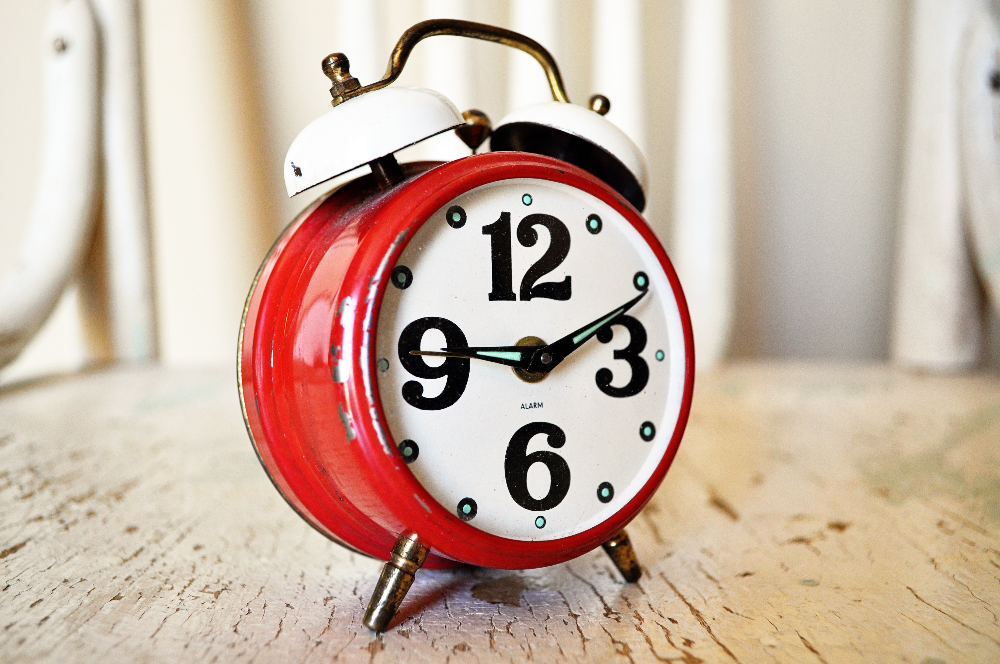

# Project: **Countdown clock**

### Difficulty level: Hard



## Description

In this project you will be creating a simple countdown clock. The user should
be able to set a number from 0 to 99, and the clock will tick from that number
down to 0.

You can try out the complete version of the project here:

<a href="https://goo.gl/Uk54ox" target="_blank">https://goo.gl/Uk54ox</a>

Use the up- and down-keys to select the number, and press the middle joystick
button (ENTER), to start counting.

## Project Manual

This project guide will tell you step-by-step the main things you have to do
in order to create a _countdown clock_. For some of the steps, you'll have to
use your own creativity to proceed, good luck!

---

### Introducing the project

The first thing you should do is open the _skeleton code_ for the project.
In programming, skeleton code means code that only has the basic elements of a
program. It is up to you to fill in the rest!

You can find the skeleton code on Trinket, here:
<a href="https://goo.gl/iPQjfU" target="_blank">https://goo.gl/iPQjfU</a>

**If you can, you should also create and account and log in to Trinket. This will
allow you to save the Trinket projects. Otherwise you have to copy the code on
to your computer to save it.**

On Trinket, you'll be able to test out your code on a *virtual* Sense HAT, before you try
out your code on the real thing.

As you might see, the skeleton code is split up into sections, divided by the headlines.
For example:

```python
#### 2. Code section
```

This guide will go through the various sections (not necessarily in order), and
help you write your code. **Very important note:** *You should add the code in the specified section in your skeleton code as you follow this guide.*

The next part of this guide will explain the stuff that's
already in the skeleton code when you first open it.

##### Explanation of the skeleton code

Before we get on to the coding, it's worth looking over the *skeleton code* and make
sure you are familiar with it.

The first few lines in the script are:

```python
#### 1.1 Import libraries

import sys
sys.path.insert(1,'/home/pi/Go4Code/g4cSense/skeleton')

from sense_hat import SenseHat
from senselib import *
```

Without going into detail, these lines are called *import statements*. They are
used to *import* code from other Python files into your own file. This is useful
because you can use other people's code to simplify your own.

The next part of the code (Sec. 1.2) creates some important *Objects* (don't worry
if you're not sure what that means) that we'll use in the later on.

Sec. 1.3 is where the initial variables of the project are set up.
You'll need to edit these values later on in order to customize the it.

Sec. 2 is where you'll let the user set how many seconds the timer should count.

Sec. 3 is where the actual counting happens.

Sec. 4 is where you let the user know that the countdown has finished.

---

### Writing the code

##### (Sec. 1.3) Set up the variables

In this section we'll be defining some variables that we will use in the project.
A lot of programming is just about knowing what information to store, and where
to store it. For example, some very important information to store is the position
how many seconds we should count.

In this project we have three variables: *countdown*, *number_color* and
*countdownMessage*. The names are pretty self-explanatory. *countdown* is how
many seconds the clock should countdown for, *number_color* is which colour the
numbers should be on the clock (right now it's black, so you probably change it!)
and *countdownMessage* is the message that should be shown when the clock has
finished counting down.

You should change these variables to what you think is appropriate!

#### (Sec. 3.1) Create a *for*-loop

We're going to skip Section 2 for now. In this section (Sec. 3) we'll create the
count down code.

In order to do this, we'll use a *for*-loop. As you heard before, a for-loop can
be used for counting things (which is exactly what we want to do!). The following
code counts from 10 to 20, in steps of 2

```python
number1 = 10
number2 = 20
step = 2

for number in range(number1, number2, step):
    print(number)
```

This should print out:

```python
10
12
14
16
18
```

Now, in our case, we want to create a for-loop that counts *down* (rather than
up) from the number stored in the *countdown* variable (see Sec. 1.3) to 0.
Using the information I just gave you above, see if you figure out how to
do that.

#### (Sec. 3.2) Draw the countdown number

Now that you have created a for-loop, you want to write code inside of it. Remember
that to write code *inside* of a for-loop, you should press the *Tab* button on your
keyboard to *indent* the text. Like this:

```python
for ....

  # [Here's some indented code]
```

*Note: Just to be clear, this also applies to other types of statements like
if-statements, while-loops, and so on.*

In this part of the code, you want to draw the number that the clock is currently
on. Since you are coding in a loop, you have to remember that this code will run *multiple*
times. So the first time it runs the code might draw the number 99, and the next time
it'll draw 98, and so on. So in-between all the times you draw the number, you have to
remember to *clear the screen* (otherwise all the numbers will be drawn on top of
each other.)

To find out how to clear the screen, and to draw the numbers, check the *Function Reference*.
You'll have to read through the different functions, and see which ones would let
you do these things.

#### (Sec 3.3) Wait a second

It wouldn't be much of a clock if it didn't actually count *seconds*! Check the
function reference again, and look for a function that let you halt the program
for a certain amount of time.

After you've completed this, you should be able to run the code! Try it and
see if it counts down properly. If it doesn't, there's probably an error
somewhere.

#### (Sec. 2.1) Create a *while*-loop

In this part of the code we're going to skip back to section 2 and write some code
that lets the user choose a number between 0 and 99, to count down from. To do this,
we'll have to use a *while*-loop.

As you might remember, a while-loop is similar to a for-loop, as it repeats the
same code several times. The difference is that a while-loop will repeat
again-and-again until *you tell it to stop*.

Go back to the link in the beginning of this document, and check out the example
solution on Trinket. See how pressing the middle-button lets the user choose
which number to count down from.

It might seem complicated, but this means that we want the while-loop to end
when the user presses the middle button (after the while-loop ends, the code
will move on to the stuff we wrote in Sec. 3 earlier).

So to complete this section of the code, write the following into (Sec. 2.1).

```python
selecting = True

while selecting:
    #rest of code inside ...
```

Later on, to make the program leave the *while*-loop, we would set the variable
*selecting* to *False*, like this:

      # Somewhere inside the while-loop
      selecting = False

#### (Sec. 2.2) Let the user choose the countdown time

Inside the while-loop, you should write the following:

```python
for event in sense.stick.get_events():
    if event.action == "pressed":
        if event.direction == "up":
            # Fill in with your own code

        elif event.direction == "down":
            # Fill in with your own code

        elif event.direction == "middle":
            # Fill in with your own code
```

This code will check if the user has pressed either the *up*, *down* or the
*middle* button on the joystick. Never mind the complicated structure, try to look
at the code and figure out how to use it.

Inside the code you find the comments *# Fill in with your own code*. Replace
these with the code that should be in there. Remember what should happen when
the user presses up, down or middle.

#### (Sec. 2.3) Draw the current countdown time

This is pretty much the same as (Sec. 3.2). Draw the countdown number that the user
is currently on.

#### (Sec. 4) Clock has finished

This is the very last part of the code. Here you should display a message to the
user that the clock has run out. Remember that the message is stored in
the *countdownMessage* variable in (Sec. 1.3).

See the *Function Reference* to find out how to display a message to the user.

#### Finished!

If it's all done, correctly, the game should now work! Don't worry if it doesn't,
things often go wrong in programming. Errors in code are usually called *bugs*. If
you have a bug in your code, you'll have to *debug* it!

If it works, congratulations! You can either move on to another project or try
to come up with new things to add to the current project. Use your creativity!
You can discuss any ideas you have with a supervisor.

---

**Author:** Lukas Kikuchi <br/>
**Date:**   August 09, 2017 <br/>
**Copyright (c)** 2017 Go4Code All Rights Reserved.
