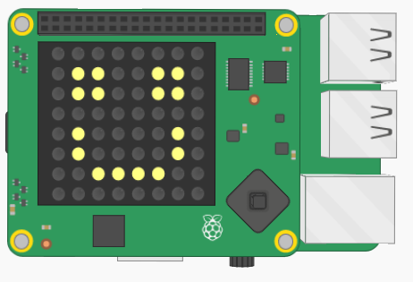

# Project: **Draw a picture**

### Difficulty level: Easy



## Description

In this project you'll learn how to draw a picture on the Sense HAT.

You can try out the complete version of the project here:

<a href="https://goo.gl/g8TbhW" target="_blank">https://goo.gl/g8TbhW</a>

Press the middle joystick button (ENTER), to make the smiley face
wink. As a bonus, you can challenge yourself by adding a similar feature to
your code.

## Project Manual

This project guide will tell you step-by-step the main things you have to do
in order to create a draw a picture on the Sense HAT. For some of the steps, you'll have to
use your own creativity to proceed, good luck!

---

### Introducing the project

The first thing you should do is open the _skeleton code_ for the project.
In programming, skeleton code means code that only has the basic elements of a
program. It is up to you to fill in the rest!

You can find the skeleton code on Trinket, here:
<a href="https://goo.gl/mBxSCg" target="_blank">https://goo.gl/mBxSCg</a>

**If you can, you should also create and account and log in to Trinket. This will
allow you to save the Trinket projects. Otherwise you have to copy the code on
to your computer to save it.**

On Trinket, you'll be able to test out your code on a *virtual* Sense HAT, before you try
out your code on the real thing.

As you might see, the skeleton code is split up into sections, divided by the headlines.
For example:

```python
#### 2. Code section
```

This guide will go through the various sections (not necessarily in order), and
help you write your code. **Very important note:** *You should add the code in the specified section in your skeleton code as you follow this guide.*

The next part of this guide will explain the stuff that's
already in the skeleton code when you first open it.

##### Explanation of the skeleton code

Before we get on to the coding, it's worth looking over the *skeleton code* and make
sure you are familiar with it.

The first few lines in the script are:

```python
    #### 1.1 Import libraries

    import sys
    sys.path.insert(1,'/home/pi/Go4Code/g4cSense/skeleton')

    from sense_hat import SenseHat
    from senselib import *
```

Without going into detail, these lines are called *import statements*. They are
used to *import* code from other Python files into your own file. This is useful
because you can use other people's code to simplify your own.

The next part of the code (Sec. 1.2) creates some important *Objects* (don't worry
if you're not sure what that means) that we'll use in the later on.

Section 2 is where you'll actually be coding.

---

### Writing the code

##### (Sec. 2) Draw a picture

Use your own imagination to draw a picture on the Sense HAT screen.

The screen is composed f 8 *rows*, where each row has 8 pixels each. So in total
we have 8*8=64 pixels. We often refer to which *row* a pixel is at as its *y-coordinate*,
and which column is at as its *x-coordinate*.

To draw a pixel, you should use the *sense.set_pixel*
function. To see how to use this function, check out the *Function Reference*.

As a simple example, the following code draws a red box:

```python
    sense.set_pixel(0, 0, 255, 0, 0)
    sense.set_pixel(0, 1, 255, 0, 0)
    sense.set_pixel(1, 0, 255, 0, 0)
    sense.set_pixel(1, 1, 255, 0, 0)
```

Try copying the code, and then play around with it by changing the numbers
in the function.

The last three numbers in the function call decides which
colour the pixel should be drawn in. They go in the order of *red*, *blue*,
*green*. Where 255 is the maximum red/green/blueness, and 0 is the lowest.
If this sounds, confusing, try playing around with the color values and try
to get a hang of it. By mixing the red, blue and green colors you can get
any of the other colors (for example, purple is blue mixed with red).

After you're done, run the code, and your picture should appear on the
screen!

#### Finished!

If it's all done, correctly, the game should now work! Don't worry if it doesn't,
things often go wrong in programming. Errors in code are usually called *bugs*. If
you have a bug in your code, you'll have to *debug* it!

If it works, congratulations! You can either move on to another project or try
to come up with new things to add to the current project. Use your creativity!
You can discuss any ideas you have with a supervisor.

---

##### Bonus: Add a "blinking"-feature (Very hard)

**Note: This part is completely optional, as it's very hard.
If this is the first project you have attempted, you should come back to this after you've
had your go at some other projects first.**

As you might have seen in the example solution we linked to at the top of this
document, we added an extra feature where the smiley-face would *blink* if you
pressed the middle joystick button.

Although it's pretty difficult, you can try adding this feature yourself to
your project. We'll give you the ingredients you'll need in order to make
this happen, but the rest is for you to figure out.

If you drew something other than a smiley-face, you might want to get your
picture to go through some other change. It's entirely up to you!

**Main loop:**

The first thing you'll need is to make all the code be in a main loop, using a
while loop.

```python
    while True:
        # more code
```

**Check if the user has pressed a button:**

Read the *Checking the joystick* part of the Function Reference to see how to
see if the user has pressed the middle joystick-button.

If the user has pressed the button, you should change the picture. In the
smiley-face case, we make the program do this change by setting a *boolean*
value to True, like this:

```python
    isBlinking = True
```

when the user has pressed the button.

Then, in the drawing part of the program, we have to use an *if*-statement to
check if the program should draw the winking smiley-face, or the normal
smiley-face.

**Clearing the screen:**

You have to remember to use *sense.clear()* to clear the screen at the end
of each loop, otherwise the drawings will overlap!

---

**Author:** Lukas Kikuchi <br/>
**Date:**   August 09, 2017 <br/>
**Copyright (c)** 2017 Go4Code All Rights Reserved.
