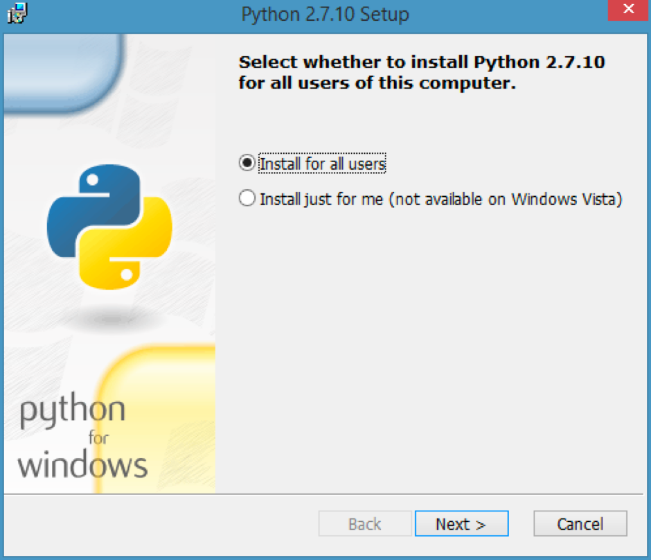
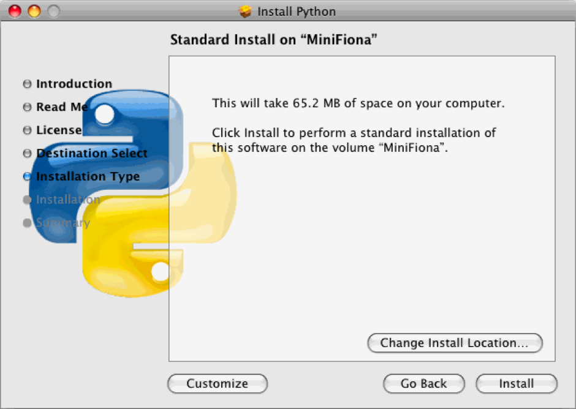

# Guide to Installing Python

The official website of python is
https://www.python.org/, it’s here where we can
download and install the python programming
language.

There are many different versions of Python, but we
recommend that you install the latest version, Python
3.6.2.

To install Python, go on the following link:
https://www.python.org/downloads/release/python-362/
Scroll to the bottom of the page, and you should see
various different files you can download.

Scroll to the bottom of the page, and you should see
various different files you can download.

If you have a Windows PC you should either download
the file called _**Windows x86-64 executable installer**_
or _**Windows x86 executable installer**_. On most
computers, you should use the former (x86-64), so try

If you have a Mac, download the file called _**Mac OS X
64-bit/32-bit installer**_.

If you open the file you just downloaded, you should
see a window like this (Top image: Windows, bottom image: Mac).

  Windows installer 

  Mac installer 

There are some settings you can change in the
installation, but in most cases the standard settings
should be fine. To install python, just click the next
button and finally install.
