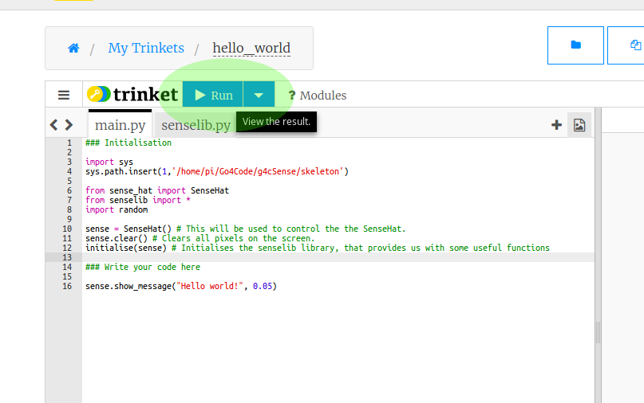

# UCL Coding Summer School - Introduction to Python and the Sense HAT

## Welcome!

Hello! This guide will take you through the basics of Python programming.

The end goal of this lecture is to get you ready to start doing some programming
of your own, in the various projects we have prepared for you.

The lecture start right from the beginning, so you don't need to have done
programming before. If you have, then use this lecture as a helpful reminder.

---

## 1. Introduction to the Sense HAT

All the projects that we're going to do during the summer school will be using
something called the *Sense HAT*. It looks like this:

</img>

The white squares that you see in the image are LED-lights, and using Python
we can make them light up to any color we like. There are 8 columns and 8 rows
of these LED-lights, which means that there are 64 in total.

On the bottom-right of the
device, you can also see that there's a *joystick*. Using this we can, for example,
create various games.

The Sense HAT can also, among other things, measure
the current temperature, the pressure in the room
and can act as a compass!

There are a *ton* of stuff you can do on a Sense HAT.
Much more than we can cover during this summer school.
That's why we're going to let you take your Sense HATs
home with you after the end!

### 1. Trinket, and writing your first program

In your projects, you'll have your own Sense HAT to play around with. But since
you'll have test around and tinker with your projects for quite some time before
its ready, we're going to be testing all our code on a *virtual* Sense HAT
on a website called *Trinket*.

Open up the following link:
<a href="https://goo.gl/JRpQfC" target="_blank">https://goo.gl/JRpQfC</a>

This opens up an example project that we've prepared. The left side of the page
has some *Python* code already. Don't worry if it all looks like gibberish right now!

</img>

The right side of the page shows nothing in the beginning, but if you press the
*Run* button, a virtual Sense HAT should appear on the screen. It won't do
much right now, because there's no code to run!

Let's create out first program. Copy the following into the Python code pane:

```Python
sense.show_message("Hello world!", 0.05)
```

After you have done that, click Run again. The message, "Hello World!" should
scroll by on the screen. You've written your first Python program!
You're now *officially* a Python programmer.

The red text you see in the Python code is what we call a *string*. A string
is basically a piece of text. In Python, we can write strings by either enclosing
text in double quotation marks like this

```Python
"This is a string!"
```

or single quotation marks, like this

```Python
'This is a string!'
```

Now, we're going to play around with this program that you've made.

Try changing the message to something else. Also, you might notice that there's
a number after the comma inside the brackets.

**Exercise 1:** Change the message to something else. Try doing it using single-quotation
marks as well.

**Exercise 2:** You might have noticed that there's a number after the string.
Try changing the value of that number. Find out what that number does.

## 2. Colours in Python: RGB-values

Let's change your program a bit more.

Replace the line in your code with the following:

```Python
sense.show_message("Hello world!", 0.05, text_colour=[255, 0, 0])
```

Run it again, and see what happens. The text should now be red. The last part of the line that you just wrote `text_colour=[255, 0, 0]` decides which color the text should be in. You can change these three numbers to change the color of the text.

We call these triplets of numbers RGB-values, and this is the reason:

- The first number decides how *red* the text should be,
- the second number decides how *green* the text should be,
- and the third number decides how *blue* the text should be.

The maximum redness/greenness/blueness is 255, and the lowest is 0. As you saw above, the RGB-value for red is [255, 0, 0].
And, for example, the RGB-value for black is [0, 0, 0].

**Exercise 3:** Make the text flash by in the following colors:
- Red
- Blue
- Green
- White
- Gray
- Purple
- Yellow
- Orange

You'll have to experiment to try to find the right color-combinations!

## 3. Commenting

Before we get going with some more interesting code, let's remove the
*sense.show_message* line so that it won't disturb us later on. But instead of
just erasing the line completely, we can *comment it out*.

To do this, simply add a hashtag # at the start of the line, like this:

```Python
# sense.show_message("Hello world!", 0.05, text_colour=[255, 0, 0])
```

Try running the code after you've commented the code out. No text should appear
on the screen. In Python we often use comment symbol # to add explanations to our
code, for example:

```Python
# This line displays some text on the screen
sense.show_message("Hello world!", 0.05, text_colour=[255, 0, 0])
```

## 4. Drawing stuff on the Sense HAT: *sense.set_pixel*

It's really easy to draw things on the Sense HAT screen. We can do this using
the function *sense.set_pixel* (if you're confused about how I just used the
word "*function*", don't worry I'll explain it in the next section.). Try adding
the following lines to your code

```Python
sense.clear()
sense.set_pixel(2, 2, 255, 255, 255)
sense.set_pixel(4, 2, 255, 255, 255)
sense.set_pixel(3, 3, 255, 255, 255)
sense.set_pixel(2, 4, 255, 255, 255)
sense.set_pixel(4, 4, 255, 255, 255)
```

It should draw a white cross on the screen. The first line, *sense.clear*,
resets all the pixels on the screen to black. This is just to avoid any
clutter on the screen if you make mistakes.

Let's see how the *sense.set_pixel* function works.

You'll recognize the last three numbers of each line, those set the colors, as we learned previously. The first two numbers decide *where* we'll draw the pixel.

The first number is what column on the screen the pixel should be drawn at. We
usually call this the *x-coordinate*.

The second number is what row on the screen the pixel should be drawn at. We usually
call this the *y-coordinate*.

**Exercise 4:** Play around with the code, and try do draw something of your own.
Maybe the first letter of your name?

**Exercise 5:** Try placing the sense.clear() line at the end of the code. What
happens? Can you explain why? After that, place the line in the middle of
the code. Again, what happens, and can you explain why that happens?

## 5. Functions

Before we move on, I'll explain (as promised) what a *function* is. A function
is simply something that we use in a code to do something for us, whether it is
drawing text on the screen, or clearing the screen of any drawings, or drawing
individual pixels.

Let's look a bit closer at the *sense.set_pixel* function.

```Python
sense.set_pixel(4, 4, 255, 255, 255)
```

The name of the function is *sense.set_pixel*. When you use a function, it's
often referred to as *calling* the function.

What about all those numbers inside the brackets? Those are called *arguments*.
Sometimes when we call a function, we want to specify exactly what we want it to do,
we do this using *arguments*.

In this case, the arguments are the numbers that specify the position of the
the pixel (the first two numbers), and the color of the pixel (the last three).

In the first example we used, we saw:

```Python
sense.show_message("Hello world!", 0.05)
```

The first argument is the message we display, and the second how fast the message
should display.

Don't worry if all of this sounds a bit complicated. It's a lot of names
for something that's quite simple. If you have any questions about this,
discuss it with a supervisor.

Before we move on, we'll introduce the *print* function. The print function
is very simple, it just displays some text. The important difference here is
that it doesn't print out text on the screen, but in the *terminal* underneath
the Sense HAT screen. It's easiest to see for yourself, copy the following code:

```Python
print("Here's some text!")
```

You should see some text appear in the lower-right corner of the page.

## 6. Using Python as a calculator

Next thing we'll do is try out some simple mathematical operations in Python.
All the main math signs you know from school exist in Python.
Using Python we can add, subtract, multiply or divide numbers.
Copy the following code to try it for yourself:

```Python
print(3+5)
print(2-7)
print(2*5)
print(4/2)
```

Run the code and see what the results are. You can also add really large numbers

```Python
print(1234567890000 + 987654321111)
```

Or do several mathematical operations in a row

```Python
print(23*52*13 + 52*611 - 412 )
```

We can also use brackets *"()"* when calculating things

```Python
print((2+3)*5)
print(6 + ((100 - 1)*42)/32)
print(((2 * (23 - 3) / (12 * 23)) - 32)*62)
```

Try changing the numbers, and try to do different calculations.

**Exercise 6:** In *Trinket*, translate the following into Python code:

    _(four times ( six minus two ) plus five) divided by two_

and use *print* to show the result.

## 7. Variables

Python allows us to store information in _variables_.  We can use the assignment operator (the _equal-to_ sign '=') to assign a value to a variable.

There are three components to variable assignment.
 - First we need to decide on the name of our variable, like my_variable.
 - Second, we set the variable name equal to something using the _equal-to_ sign '='.
 - Third, we write the value that the variable should be equal to.

Like this:

```Python
my_variable = 123
```

We can also store strings in a variable:

```Python
my_variable = "Hello!"
```

Note that the variable name must be written as _one single set of characters_ without spaces. So, for example, *my variable* would not be a valid name for a variable.

The code below shows how easy it is to define and display a variable.

```Python
myNumber = 5*7
someText = "Five times seven is "
myMessage = someText + str(myNumber)

sense.show_message(myMessage, 0.05)
```

Can you look at this code and figure it out what it does without actually running it?
After you have guessed, write the code in your Trinket project and run it.

Explanation: We have used the *str* function to convert the number 5*7 to a *string* "35". Then we added the string "Five times seven is " with "35" to form "Five times seven is 35".

**Exercise 7:** Write a program that displays your full name and age on the screen.
Store your full name in a variable called *myName*, and store your age in a variable
called *myAge*. Remember that you have to convert numbers to strings using the *str*
function.

## 8. A basic program

Variables are quite useful, as they allow us to remember numbers (or other types of data, like _strings_) in terms of more memorable variable names. We can use these variables in our programs to compute things. Below is an example of a basic program that calculates how many minutes there are in a week.

```Python
minutes_in_an_hour = 60 # storing the number of minutes in an hour into a variable
hours_in_a_day = 24 # Storing hours in a day into a variable
days_in_a_week = 7

# calculate the minutes in the week

minutes_in_a_week = minutes_in_an_hour*hours_in_a_day*days_in_a_week

print("There are" , minutes_in_a_week , "minutes in a week")
```

You don't have to copy this code, you can go on the following link to see the
code in action: <a href="https://goo.gl/CZH1UX" target="_blank">https://goo.gl/CZH1UX</a>.

But before you run it, try to just read the code and figure out what it does
yourself. It's good practice!

## 9. If-and-else statements

This next part is where things get more interesting (and a bit more complicated)!

The *if*-statement allows us to make a program that reacts in different ways, under different conditions. Think of it as a way to ask a computer questions.

Look at the code below, can you guess what it does?

```Python
myName = "Lukas"

if myName == "Ishan":
  sense.show_message("Your name is Ishan", 0.03)
else:
  sense.show_message("Your name is not Ishan", 0.03)
```

Copy the code into your project. How can you change the variable *myName* so
that the result of the program is different?

Note that the code inside the _if_ and the _else_ clause are indented (2 spaces away from the left), the indentation tells the computer which parts of the code are inside the 'if' and the 'else' statements. To add an *indentation* to your code, press the *Tab* key on your keyboard.

Essentially, the *if*-statement checks whether something is true or not. The
dobuble-equals sign "==" means "is equal to". So the code above translates
to (in English):

    If *myName* is equal to "Ishan", show "Your name is Ishan". If *myName* is
    not equal to "Ishan", show "Your name is not Ishan".

The code that is in the *true* part of the code, is on the lines below the *if*.
The code that is in the *false* part of the code, is on the lines below the *else*.

We can also create *if*-statements using numbers:

```Python
my_variable = 10

if my_variable < 20:
    print("The number is less than 20.")

if my_variable < 1:
    print("The number is less than 1.")

if my_variable > 5:
    print("The number is larger than 5.")

if my_variable == 11:
    print("The number is equal to 11.")

if my_variable > 55:
    print("The number is larger than 55.")

if my_variable == 10:
    print("The number is equal to 10.")
```

You don't havet copy this code, you can see it here: <a href="https://goo.gl/jpmjLj" target="_blank">https://goo.gl/jpmjLj</a>. Before running
it, read the code and guess what it does.

In the code above, we were able to compare numbers in the if statements using the
<, > and == symbols. Here's
an explanation for what these symbols mean:
 - **a > b**  a is greater than b.
 - **a < b**  a is less than b.
 - **a >= b** a is greater than or equal to b.
 - **a <= b** a is less than or equal to b.
 - **a == b** a is equal to b. We use double equals because single equals is used to assign values to variables.

This is all quite a lot of information already, so if you find it confusing,
try to dicsuss it with a supervisor or the person sitting next to you. Don't
worry if you don't understand everything yet!

**Exercise 8:** Write a program that does the following:
- Define a variable called *myNumber*, and assign it any number you like.
- Using if-statements, make the program say whether the number is positive, negative or equal to zero.

## 10. Lists

In Python, we can not only store numbers and strings in variables, we can also store
a *list* of items in a variable.

```Python
myList = [42, 51, 62, "Hello", 61, 123, "World"]
```

We already saw a list early on in the lecture. The RGB colors were stored in lists.

If we want to access individual elements in the list, we can do it like this:

```Python
myList = [42, 51, 62, "Hello", 61, 123, "World"]

# The first element in the list
print(myList[0])

# The third element in the list
print(myList[2])

# The fifth element in the list
print(myList[4])
```

Copy this code and see what it does. Note that the *first* element is given
by the number *0* in the list, and the second by *1* and so on...

**Exercise 8:** Repeat Exercise 7, but instead of storing your
name and age is separate variables, store them in a *single* list.

## 11. For-loops

Sometimes you might want to repeat the same piece of code several times. Loops allow us to accomplish this in fewer lines of code, by _repeating_ code until our operation is complete.

Look at the code below, what do you think it does? See if you can figure it out before you run it.

```Python
for n in range(1,10):
  print("The number is", n )
```

Now copy the code and run it. Did you guess correctly?

How about this code?

```Python
for n in range(1, 5):
  sense.set_pixel(n, 0, 0, 0, 255)
```

This one is more complicated. Try to imagine what this could do. After that,
copy it and see for yourself.

Play around with the code and see if you can make it do more complicated!

**Exercise 9:** Write a program that *prints* the numbers from 50 to 100.

**Exercise 10:** Write a program that draws a line of yellow pixels from the
top-left corner, to the bottom-right corner.

## 12. While-loops

Another type of loop that we can use in Python is the _while loop_.

The while loop repeats its code as long as the expression after the _while_ command evaluates to _true_. You can think of it as a mix between an _if-statement_ and a _for-loop_.

The previous explanation might be a bit complicated to follow, but if you look at the code below you can see that it's quite intuitive.

```Python
n = 0 # Initialising n
while n<10: # Starting the loop with condition that n must be less than 10
    n = n+1 # redefines n as n+1
    print(n) # print the new value of n
```

As usual, look at the code and try to figure out what it does. After that copy
it and see for yourself!

What do you think will happen if you run the following code?

```Python
while True:
  print("Hello!")
```

Don't try to run it! What will happen is that the code will run *forever*,
can you see why? It'll print out "Hello!" again and again and it wont stop!
Although never-ending codes like this might seem useless to you, it does
actually come in handy, and we'll often use them in our projects!

**Exercise 11:** Redo exercise 10, but with a *while*-loop, instead of a
*for*-loop.

## 13. What's next?

The next thing is to ask yourself if you've understood everything!
We covered quite a lot, and very quickly, so it might be worth to just have a quick read-through of everything again.

After that, it's time to start choosing a project. You should try to start off with one of
the easier projects, before attempting any harder ones. Remember that you can
always ask for help within your group, or by a supervisor, during the entirety of the summer school.

We discussed some useful functions in this lecture, like *sense.set_pixel* and *print*. There
are many more functions you can use, and the best way to check them all out is by reading
the *Function Reference* document. Use that document as a reference on how to use various
Python functions.

Good luck!

---

**Author:** Lukas Kikuchi <br/>
**Date:**   August 09, 2017 <br/>
**Copyright (c)** 2017 Go4Code All Rights Reserved.
