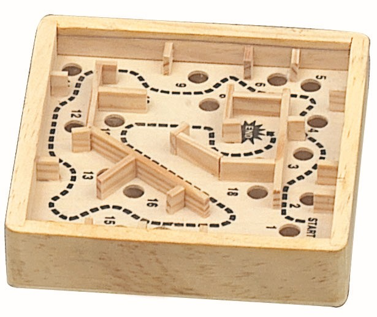
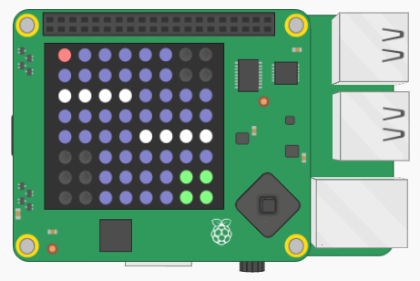
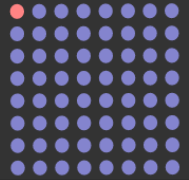

# Project: Marble Maze

### Difficulty level: Medium

</img>

## Description

In this project you'll be creating a digital version of Marble Maze (see the
  picture if you don't know what it is).
The Sense HAT can tell whether you're tilting your device, using this feature
we can create the game. You'll also get to design your own maze in this
project.

Check out an example solution of the game here: <a href="https://goo.gl/uGzkKz">https://goo.gl/uGzkKz</a>

*To control the ball on Trinket, drag the Sense HAT around in the different
directions with your mouse*.

## Project Manual

This project guide will tell you step-by-step the main things you have to do
in order to create _Marble Maze_. For some of the steps, you'll have to figure out
how to proceed yourself, good luck!

---

### Introducing the project

The first thing you should do is open the _skeleton code_ for the project.
In programming, skeleton code means code that only has the basic elements of a
program. It is up to you to fill in the rest!

You can find the skeleton code on Trinket, here:
<a href="https://goo.gl/TEVxE8">https://goo.gl/TEVxE8</a>

**If you can, you should also create and account and log in to Trinket. This will
allow you to save the Trinket projects. Otherwise you have to copy the code on
to your computer to save it.**

On Trinket, you'll be able to test out your code on a *virtual* Sense HAT, before you try
out your code on the real thing.

As you might see, the skeleton code is split up into sections, divided by the headlines.
For example:

```python
#### 2. Code section
```

This guide will go through the various sections (not necessarily in order), and
help you write your code. **Very important note:** *You should add the code in the specified section in your skeleton code as you follow this guide.*

The next part of this guide will explain the stuff that's
already in the skeleton code when you first open it.

#### Explanation of the game

The game you'll be working works very similarly to an actual Marble Maze game. Here's
a screenshot of the game:

</img>

You have a ball (red dot in the picture) that you control move around by tilting the Sense HAT. The ball can collide and
be stopped by the walls (white dots in the picture) of the maze. The player loses if
the ball goes in the holes (black dots). And the player wins if the ball goes in
the goal (green dots).

##### Explanation of the skeleton code

Before we get on to the coding, it's worth looking over the *skeleton code* and make
sure you are familiar with it.

The first few lines in the script are:

```python
#### 1.1 Import libraries

import sys
sys.path.insert(1,'/home/pi/Go4Code/g4cSense/skeleton')

from sense_hat import SenseHat
from marble_maze_lib import MarbleMaze
import random
from senselib import *
```

Without going into detail, these lines are called *import statements*. They are
used to *import* code from other Python files into your own file. This is useful
because you can use other people's code to simplify your own.

The next part of the code (Sec. 1.2) creates some important *Objects* (don't worry
if you're not sure what that means) that we'll use in the game code.

Sec. 1.3 is where we set up the initial properties of the game is set up. Like
the starting position of the ball, the color of the ball, the color of the wall,
the goal and the holes and so on. You'll need to edit these values later on in
order to customize the game.

Sec. 1.4 is where you'll create your maze!

Sec. 2 is the part where you'll get your hands dirty with some real python game
programming. If you look at it now, there's not much there:

```python
#### 2. Main game code

while True:

    #### 2.1 Make the ball move

    #### 2.2 Draw the walls, holes, goals and the ball

    #### 2.3 Make things happen

    #### 2.4
```

You'll be filling in each section with your own code. The most important thing to note is

```python
while True:

    # ... The rest of the code ...
```

The *while* part of the code is what we call the *main loop*. All the code that's
*inside* the while-clause will be repeated again and again until the game ends.
That's why we call it a loop!

---

### Writing the code

##### (Sec. 1.3) Set up the game variables

In this section we'll be defining some variables that we will use in the game.
A lot of programming is just about knowing what information to store, and where
to store it. For example, some very important information to store is the position
of the marble ball on the screen. To set the ball position, you have to edit
this line:

```python
game.setBallPosition(0, 0)
```

Replace the first number with the *x*-position of the ball, and the second
number with the *y*-position. If you don't know what that means, the x-position
is how many squares the ball is away from the left side of the screen, and the
y-position is how many squares the ball is away from the top side of the screen.

The rest of the lines in this section decides the colors of all the things in
the game. Currently all the colors are set to black, so you'll definitely
have to change them to something, although you can decide which colors yourself.

Colors in Python are not called "purple", "yellow" or "brown". Instead they are given
by *three* numbers. The first number is how *red* the color is, the second number
is how *green* it is, and the third how *blue* it is. The value of the redness/greenness/blueness
can be from 0 to 255 (where 255 is the maximum redness/greenness/blueness). For example
to set the ball to be purple, we set it to be maximum red and maximum blue, like this:

```python
game.ballColor = [255, 0, 255]
```

Confusing? Try setting the colors to different things later to get the hang of it.

#### (Sec. 2.2) Draw the walls, the holes, the goals and the ball

In this section we'll write code that draws stuff on the Sense HAT.

The first thing we want to do is to draw the floor. You do this using the function:

sense.clear(red, green, blue)

You can replace *red*, *green* and *blue* with any numbers that you like. You should
add this code to the start of the section.

The next thing is to add code that will draw the walls, the holes and the goal
blocks. In order to do this, you simply have to add the following lines of code:

```python
game.drawWalls()
game.drawHoles()
game.drawGoals()
```

The final thing is to draw the ball. To do this you use the function:

```python
sense.set_pixel(x, y, red, green, blue)
```

Where *x* and *y* is the position of the ball, and *red*, *green* and *blue* the
color of the ball. You can get the *x* and *y* positions of the ball using:

```python
game.getBallX()
game.getBallY()
```

You'll have to use these functions within the *sense.set_pixel*. The color of the
ball is in the *game.ballColor* variable. For more information about how the function
works, you can check the *Function Reference* document.

After you've added all of this, all the stuff should be drawn on the scren if you
start it! Because you haven't yet added anything, it should look similar to this:

</img>

#### (Sec. 2.1) Make the ball move

In this section, you'll be making the ball move by tilting the Sense HAT.

Using the *game.moveBallHorizontally* and *game.moveBallVertically* functions,
we can tell the game how tilted the Sense HAT is, and how fast the ball should
move across the screen. For example, to tell the game that HAT is tilted
*20 degrees* horizontally, and *40 degrees* vertically:

```python
game.moveBallHorizontally(20)
game.moveBallVertically(40)
```

To get how much the Sense HAT is tilted horizontally, use:

```python
sense.get_orientation()["pitch"]
```

To get how much the Sense HAT is tilted vertically, use:

```python
sense.get_orientation()["roll"]
```

If you run the game now, the ball should move across the screen as you tilt the
Sense HAT.

#### (Sec. 1.4) Create the maze!

This is a fun section! Here, you'll be creating the maze.

To create a wall pixel:

```python
game.placeWall(x, y)
```

where *x* and *y* should be replaced by numbers. To create a hole pixel:

```python
game.placeHole(x, y)
```

if the ball falls in the hole, the player will lose. To create a goal pixel:

```python
game.placeGoal(x, y)
```

At the start, all the pixels are automatically floor pixels, so you don't need to
add them.

After you've made the maze, try running the game. All the things you placed
should be on the screen!

#### (Sec. 2.3) Make things happen

This one is simple, just add the following line:

```python
game.update()
```

This line should make sure that the ball collides properly with the walls.

#### (Sec. 2.4) Check if the player has won or lost

As we mentioned earlier, you can get the *x* and *y* positions of the ball using:

```python
game.getBallX()
game.getBallY()
```

The following function can be used to check whether there's a hole at a particular
position:

```python
game.isHole(x, y)
```

The function will return *True* if there's a hole at the position (*x*, *y*).
The following function can be used to check whether there's a goal at a particular
position:

```python
game.isGoal(x, y)
```

The function will return *True* if there's a goal at the position (*x*, *y*).

It might seem a bit tricky but using these functions you should be able to check
whether a player has lost (if the ball's position is on a hole) or has won
(if the ball's position is on a goal).

The way to do this is using an *if*-statement. If you forgot what that was,
check the introduction lecture from earlier, or ask a supervisor.

If the player has lost or won, the ball should be placed in the starting position
again, so the player can play again.

#### Finished!

If it's all done, correctly, the game should now work! Don't worry if it doesn't,
things often go wrong in programming. Errors in code are usually called *bugs*. If
you have a bug in your code, you'll have to *debug* it!

If it works, congratulations! You can either move on to another project or try
to come up with new things to add to the current project. Use your creativity!
You can discuss any ideas you have with a supervisor.

---

**Author:** Lukas Kikuchi <br/>
**Date:**   August 09, 2017 <br/>
**Copyright (c)** 2017 Go4Code All Rights Reserved.
