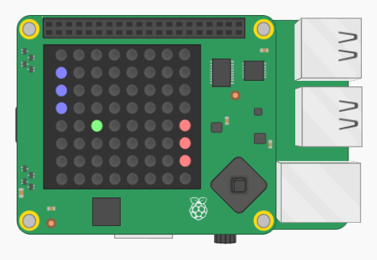

# Project: Pong

### Difficulty level: Very hard



## Description

**Note: This project is very hard, so you might want to attempt an easier project
before doing this one.**

In this project you'll be creating the classic game _Pong_ on the Sense HAT. The game
will be made from ground-up, so it's definitely one of the harder projects to do.

You can try out the complete version of the game here:

<iframe src="https://trinket.io/embed/python/c9cb8d15f4?outputOnly=true" width="100%" height="600" frameborder="0" marginwidth="0" marginheight="0" allowfullscreen></iframe>

Use the up and down keys to move your paddle.

## Project Manual

This project guide will tell you step-by-step the main things you have to do
in order to create _Pong_. For some of the steps, you'll have to figure out
how to proceed yourself, good luck!

---

### Introducing the project

The first thing you should do is open the _skeleton code_ for the project.
In programming, skeleton code means code that only has the basic elements of a
program. It is up to you to fill in the rest!

You can find the skeleton code on Trinket, here:
<a href="https://goo.gl/77PmJ8" target="_blank">https://goo.gl/77PmJ8</a>

**If you can, you should also create and account and log in to Trinket. This will
allow you to save the Trinket projects. Otherwise you have to copy the code on
to your computer to save it.**

On Trinket, you'll be able to test your code on a *virtual* Sense HAT, before you try
your code on the real thing.

As you might see, the skeleton code is split up into sections, divided by the headlines.
For example:

```python
#### 2. Code section
```

This guide will go through the various sections (not necessarily in order), and
help you write your code. **Very important note:** *You should add the code in the specified section in your skeleton code as you follow this guide.*

The next part of this guide will explain the stuff that's
already in the skeleton code when you first open it.

##### Explanation of the skeleton code

Before we get on to the coding, it's worth looking over the *skeleton code* and make
sure you are familiar with it.

The first few lines in the script are:

```python
import sys
sys.path.insert(1,'/home/pi/.Go4Code/g4cSense/pong/skeleton')


from sense_hat import SenseHat
from pong import Pong
import random
from senselib import *
```

Without going into detail, these lines are called *import statements*. They are
used to *import* code from other Python files into your own file. This is useful
because you can use other people's code to simplify your own.

The next part of the code (Sec. 1.2) creates some important *Objects* (don't worry
if you're not sure what that means) that we'll use in the game code. This part
of the code also displays a message to the user when first starting the game:

sense.show_message("PONG!") # Display an intro message for the viewer.

Sec. 1.3 is where we set up the initial properties of the game,
like the position of the ball, the positions of the player and the computer,
the colour that the should drawn in, and so on. This is the first part of the skeleton
code that you will be writing in.

Sec. 2 is the part where you'll get your hands dirty with some real python game
programming! If you look at it now, there's not much there:

##### Main game code

```python
while True:

  #### 2.1 Check for player1 movement (joystick)

  #### 2.2 Let computer control player2

  #### 2.3 Find new ball position

  #### 2.4 Check if new ball position has hit the player pads

  #### 2.5 Check if new ball position is in goal

  #### 2.6 Check if new ball position has collided with the top or bottom walls

  #### 2.7 Update ball position

  #### 2.8 Clear screen

  #### 2.9 Draw player1 and player2

  #### 2.10 Draw ball

  #### 2.11 Wait a little bit before the next frame
```

That's a lot of code to fill in! Don't worry though, this guide will take you
through each step of the way. The most important thing to note is

```python
while True:

    # ... The rest of the code ...
```

The *while* part of the code is what we call the *main loop*. All the code that's
*inside* the while-clause will be repeated again and again until the game ends.
That's why we call it a loop!

---

### Writing the code

##### (Sec. 1.3) Set up the game variables

In this section we'll be defining some variables that we will use in the game.
A lot of programming is just about knowing what information to store, and where
to store it. For example, some very important information to store is the position
of the Pong ball on the screen.

You see that we have two players: player1 and player2. Player 1 is the (human) user
playing the game, and player 2 is controller by a computer. Player 1 is on the left
side of the screen, and player 2 is on the right.

If you look at the values in the skeleton code, you'll notice that they're all set
to zero. You'll have to think of some more appropriate values to set them to! For the
colours of the players and the ball, change them to whatever you want them to look like.
If you leave the colours like they are, you won't see them on the screen, as they'll
be coloured black!

By reading the comments of the variables, you can figure out what they mean
(if you don't, ask a supervisor!). There are two variables that might look
a bit strange to you at first:

```python
pong.ballVelocityX = random.choice([-1, 1]) # Randomizes the vertical velocity of the ball.
pong.ballVelocityY = random.choice([-1, 1]) # Randomizes the horizontal velocity of the ball.
```

These variables are the horizontal and vertical velocities of the ball (horizontal means
the left and right directions, and vertical means the up and down directions).
If, for example, _pong.ballVelocityX = -1_ and _pong.ballVelocityY = 1_ ,the ball is moving
to the left and down at the same time (so the ball is moving diagonally to the bottom-left).

The following piece of code

```python
random.choice([-1, 1])
```

randomizes the initial velocity of the ball. The result of that is _either_ -1 or 1,
by random.

#### (Sec. 2.8-2.10) Draw the players and the ball

These sections are very straightforward. Use the *sense.set_pixel* and the *drawVerticalLine*
functions to draw the players and the ball on the screen. Check the *Function reference* document
to see how you use these functions.

The position of the ball is given by *pong.ballX* and *pong.ballY*. The colour of the ball
is in *pong.ballColour*. Since the ball is only one pixel, you should *sense.set_pixel*.

Similarly, you should use the *drawVerticalLine* function to draw the player1 and player2
paddles. Player1 should be on the left side of the screen, so its x-coordinate should be
0, whilst player2 is on the right side of the screen, so its x-coordinate should be 7.

Once you've done this, you can try running the game. The screen should look something
like


In Sec. 2.8, add the following line, in order to clear the screen each game loop.
This is important, as otherwise if the ball moves across the screen, it'll leave a trail!

```python
sense.clear()
```

#### (Sec. 2.1) Control player1

In this section you'll add some code that lets the user control player1. Read the
*Checking the joystick* section in the *Function reference* document to see how
you could go about doing this.

What you want to do is to check if the user presses up on the joystick, in which
case you'll decrease the value of pong.player1pos by 1.

```python
pong.player1pos = pong.player1pos - 1
```

Or if the user presses down

```python
pong.player1pos = pong.player1pos + 1
```

#### (Sec. 2.2) Let computer control player2

This part is easy. We have prepared some code, that will control the player2 paddle
for us. Just add the following line to the

```python
pong.updatePlayer2()
```

*If you really want a challenge, you could skip using our code and try to do it
yourself!*

#### (Sec. 2.3) Ball movement

From now on the programming gets a bit trickier, so pay attention to every detail!

Every frame, the ball should move a step (otherwise Pong wouldn't be much of a game).
The direction of the movement is given by the velocity variables we went through earlier:
*pong.ballVelocityX* and *pong.ballVelocityY*.

In Sec. 2.3 the code should calculate the new position of the ball. The code should
look something like this:

```python
newBallX = # ... Your code here
newBallY = # ... Your code here
```

Figure out what you should write after the equal signs!

#### (Sec. 2.4) Check if new ball position has hit the player paddles

This part is tricky! We now have to see if the if the ball has bounced off of
the player paddles. I'll go into detail about how we would check this for player1, and then you can
figure out how we'd do it for player2 yourself.

If the ball has hit the player1 paddle, newBallX should equal to 0 (it should be on
the leftmost part of the screen). For the y-coordinate of the ball, it should
be such that it's aligned with the y-coordinate of the paddle, adjusting for its
size.

If the ball collides with the paddle, the pong.ballVelocityX should be reversed
(if it's negative, it should become positive. If it's positive it should
become negative).

Here's the code that would accomplish this:

```python
if newBallX == 0:
  if pong.ballY >= pong.player1pos and pong.ballY <= (pong.player1pos + pong.player1size):
    pong.ballVelocityX = -pong.ballVelocityX
    newBallX = pong.ballX + pong.ballVelocityX
    newBallY = pong.ballY + pong.ballVelocityY  
```

#### (Sec. 2.5) Check if new ball position is in goal

Now we have to check ball has landed in either of they player's goals. Once again,
I'll go through the code for player1, and you'll figure it out for player2 yourself.

It's confusing, but the way we'll check if the ball has landed in the goal is if the
x-coordinate of the ball is -1. That is, if it's gone beyond the boundary of the
screen. If it has, it is safe to assume that player2 has scored.

If the ball has gone into the goal, there are a couple of things we need to do:
- Reset the ball position to the middle of the game.
- Add a point to the player score.
- Show a victory message (use the function sense.show_message)

#### (Sec. 2.6) Check if new ball position has collided with the top or bottom walls

This bit might seem tricky, but it's actually quite simple. If the ball collides
with either the top or the bottom part of the game screen, the pong.ballVelocityY
has to be reversed, like this:

```python
pong.ballVelocityY = -pong.ballVelocityY
```

#### (Sec 2.7) Update ball position

You need to update the variables that store the ball position with newBallX
and newBallY here, otherwise the ball won't move at all!

#### (Sec. 2.11) Add a delay to each game loop

To prevent the game from moving too fast, we're going to add some time-delay to
each loop of the game. We'll basically tell the computer to wait *X* amount of time
before starting another loop. You can do this using the *wait* function. Try
to find an appropriate amount of time to wait.

#### Finished!

If it's all done, correctly, the game should now work! Don't worry if it doesn't,
things often go wrong in programming. Errors in code are usually called *bugs*. If
you have a bug in your code, you'll have to *debug* it!

If it works, congratulations! You can either move on to another project or try
to come up with new things to add to the current project. Use your creativity!
You can discuss any ideas you have with a supervisor.

---

**Author:** Lukas Kikuchi <br/>
**Date:**   August 09, 2017 <br/>
**Copyright (c)** 2017 Go4Code All Rights Reserved.
