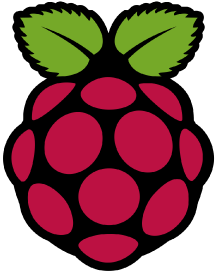
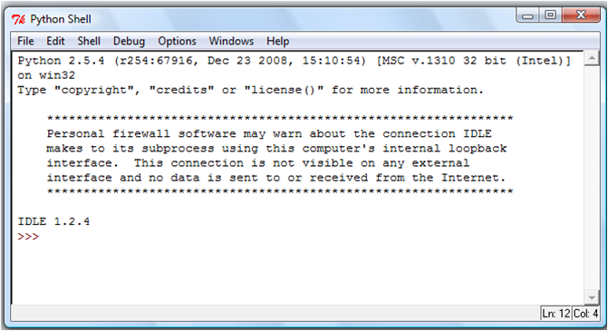

<h1>
 Using the Sense HAT    Go4Code     
 </h1>

Your Sense HATs have been pre-programmed by the Go4Code team to do some clever things in the background so that that you can easily run python files without needing to plug the Raspberry Pi into a TV or monitor. All you need to do is put a python file with your code on a USB stick and plug it into the Raspberry Pi!

In this guide we will go through the process of transferring code written in Trinket on the desktop to running it on the Raspberry Pi.

## Writing Code in Trinket

Each project script has a link to a Trinket Emulator where you will develop code to complete the projects. Now that you have gone through the introduction to programming session, you should be slightly familiar with programming the Sense HAT.

To demonstrate how to run code on your Sense HATs we will be displaying a simple message on the Sense HAT screen.

Click on this link to open the Trinket Emulator for this guide: https://trinket.io/python/bf3cadd959. This should open the Trinket Emulator web-page.

**If you like you can create a Trinket account by clicking the *Sign Up* icon in the top left corner, it takes 2 minutes and will allow you to save your projects so you can access them from anywhere.**

**Task:** In the Trinket Emulator on the web-page, write code that will display the message "Hello World" on the Sense HAT's display.

Click the run button below to see what your code should do:

<iframe src="https://trinket.io/embed/python/6ac4dc457a?outputOnly=true&runOption=run" width="100%" height="600" frameborder="0" marginwidth="0" marginheight="0" allowfullscreen></iframe>  Trinket Emulator 

If your code displays the "Hello World" message as shown above, you are ready to transfer it to the Raspberry Pi!

## Creating python files in  IDLE

Some of you may be familiar with IDLE. Don't worry if you've never seen it before, it is just a program in which we can write and run python code. We will be using it to create python files.

Before we start, go to documents and create a folder called Go4Code. You should save all your python files in this folder.

Let's open the IDLE program on your computers. Click start and type IDLE in the search bar and press enter.

This will open up a window like this:

     

The Python Shell

   

Click file -> new file. This should open up a window like the one below:

Copy your code in here as shown in the images below:

Now go to *File* and click *Save As* and save the file as test.py in . You can call your files anything really, as long as the names do not have spaces and end the with *.py* extension. This tells the computer that the file we have created is a python file.

## Run Your Code on the Raspberry Pi
**If you don't understand anything in this section, feel free to ask your supervisor**
Now copy the python file you just created, *test.py*, onto the memory stick. Now **safely remove** the USB drive and plug it into the Raspberry Pi.

The Raspberry Pi will now copy the code from the USB stick onto it's own memory and will display the name of your file on the screen.

This is the Main Menu on our Raspberry Pi Sense HAT interface. It has all the python files that we copy on to the Raspberry Pi using the memory stick. If you move the joystick to the right, the screen will show the next file in the folder, if you move it to the left it will show the previous file. To select and run a file press the middle button on the joystick on the Sense HAT.

## Recap

So, just to go over things again. To write code and run it on your Raspberry Pi:

  1. Write and test your code on the Trinket Emulator.
  2. Open IDLE and copy the code from Trinket into a new file.
  3. Save the file with your code with any name as long as it ends with the *.py* extension.
  4. Copy the python file (*.py* file) onto your USB stick.
  5. Safely remove your USB stick and plug it into your Raspberry Pi.
  6. Press the middle button to run a file or press left and right to scroll through and find a different file.

Great now you are ready to start on your own project!

---

**Author:** Ishan Khurana  
**Date:**   August 10, 2017  
**Copyright (c)** 2017 Go4Code All Rights Reserved.
