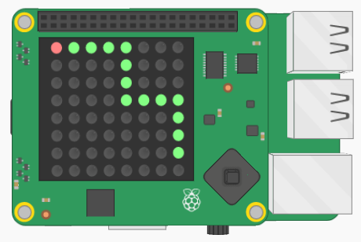
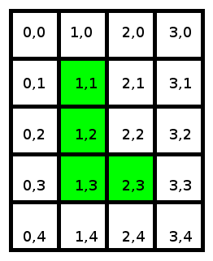

# Project: Snake

### Difficulty level: Medium


## Description

In this project, you'll recreate the classic game *Snake*.

You can try out the complete version of the project here:

<a href="https://goo.gl/qXzrui" target="_blank_">https://goo.gl/qXzrui</a>

Use the up, down, left and right keys to move the snake around. Eat the
apples to grow.

## Project Manual

This project guide will tell you step-by-step the main things you have to do
in order to create the game *snake*. For some of the steps, you'll have to
use your own creativity to proceed, good luck!

---

### Introducing the project

The first thing you should do is open the _skeleton code_ for the project.
In programming, skeleton code means code that only has the basic elements of a
program. It is up to you to fill in the rest!

You can find the skeleton code on Trinket, here:
<a href="https://goo.gl/VkEkW1" target="_blank_">https://goo.gl/VkEkW1</a>

**If you can, you should also create and account and log in to Trinket. This will
allow you to save the Trinket projects. Otherwise you have to copy the code on
to your computer to save it.**

On Trinket, you'll be able to test out your code on a *virtual* Sense HAT, before you try
out your code on the real thing.

As you might see, the skeleton code is split up into sections, divided by the headlines.
For example:

```python
#### 2. Code section
```

This guide will go through the various sections (not necessarily in order), and
help you write your code. **Very important note:** *You should add the code in the specified section in your skeleton code as you follow this guide.*

The next part of this guide will explain the stuff that's
already in the skeleton code when you first open it.

##### Explanation of the skeleton code

Before we get on to the coding, it's worth looking over the *skeleton code* and make
sure you are familiar with it.

The first few lines in the script are:

#### 1.1 Import libraries

```python
import sys
sys.path.insert(1,'/home/pi/Go4Code/g4cSense/skeleton')

from sense_hat import SenseHat
from snake_lib import Snake
import random
from senselib import *
```

Without going into detail, these lines are called *import statements*. They are
used to *import* code from other Python files into your own file. This is useful
because you can use other people's code to simplify your own.

The next part of the code (Sec. 1.2) creates some important *Objects* (don't worry
if you're not sure what that means) that we'll use in the later on.

Sec. 1.3 is where the initial variables of the project are set up.

Sec. 2.1 is where we'll write code that lets the user control the snake.

Sec. 2.2 is where we'll draw the snake on the screen.

Sec. 2.3 is where we'll make the snake move.

Sec. 2.4 is where we'll check if the snake has collided with itself, in which
case the player will lose the game.

Sec. 2.5 is where we'll check if the snake has eaten an apple, in which case
the snake should grow.

Sec. 2.6 we add some delay into the game, so that it won't move too fast.

---

### Writing the code

##### (Sec. 1.3) Set up the game variables

In this section we'll be defining some variables that we will use in the game.
A lot of programming is just about knowing what information to store, and where
to store it. For example, one important piece of information to store is the position
of the apple on the screen. If you look at the skeleton code, you see that
there's a variable called *applePosition*.

```python
applePosition = [1, 1]
```

The first number is its x-coordinate, and the second number is the y-coordinate.
If you don't know what that means, the x-position
is how many squares the ball is away from the left side of the screen, and the
y-position is how many squares the ball is away from the top side of the screen.

Every time the snake eats the apple, we'll set a new position in *applePosition*.

The line

```python
snake = Snake([3,3])
```

creates the snake *object* that we see on the screen. The two numbers you see is also
the starting position of the snake.

The final two variables are the colors that we will draw the snake and the
apple in

```python
snakeColor = [0, 255, 0] # Color of the snake
appleColor = [255, 0, 0] # Color of the apple
```

Colors in Python are not called "purple", "yellow" or "brown". Instead they are determined
by *three* numbers. The first number is how *red* the color is, the second number
is how *green* it is, and the third how *blue* it is. We've currently set
the snake to be green, and the apple to be red, but feel free to change that!

##### (Sec. 2) Main program code

Before we start coding, we'll explain a bit what's going on in Sec. 2.

In this part of the code, we'll do all the main programming.
If we look at the skeleton code, we see that the section is within a *while*-loop.
Remember that code inside a while loop runs again and again, until we tell it to
stop. The reason why we want our program to be in a loop is because we want
to continually check if the user has shaken the device.

Because the code is in the *while*-loop, remember that you have to add
a *Tab* at every line, to make it indented. Like this:

```python
while True:
    # write your code like this,
    # with a tab at the start of the line.
```

##### (Sec. 2.2) Draw the snake and the apple

*Clearing the screen*

The first thing you want to do before drawing anything is to clear the screen
of any drawings. This is important, because otherwise all drawings will be stacked
on top of each other. You can do this using the *sense.clear()* function.

```python
sense.clear() # Clears the screen
```

*Drawing the snake*



If you look at the image, you see that the snake's body can twist and turn into
quite a complicated shape! Luckily, we have already prepared some code that
keeps track of the snake's body behind-the-scenes. It's now your job to draw the snake.

This part bit is a bit complicated! So we'll start with some background explanation,
before we get to how to do this part of the code.

The snake's body is stored in a *list*, where the *elements* of the list are
*x*- and *y*-coordinates. For example, the body of a snake that is in an *L*-shape could
be represented like this:

```python
snake_body = [ [1, 1], [1, 2], [1, 3], [2, 3] ]
```

This is shown in the picture below:



Look at the numbers to get a feeling of how the *x* and *y*-coordinates work.
If you're having trouble understanding how this works, ask a supervisor about it!

Now that we've explained how the snake's body is stored in a list, we can go on
to explain how to draw the body. As we mentioned earlier, the snake's body is
kept track of behind-the-scenes. So all you need to do is to call a function
that we've made that returns the snake's body.

```python
snake_body = snake.get_body() # Gets the body of the snake, containing all the positions.
```

Now that we have a list of all the points that the snake consists of, we can start
drawing it. We're going to do this using the *for*-loop you learned about earlier.
We can use a *for*-loop to go through each element in a list in order.  For example,
the following code

```python
snake_body = [ [1, 1], [1, 2], [1, 3], [2, 3] ]

for bodypart in snake_body:
    print(bodypart)
```

Will print out:

```python
[1,1]
[1,2]
[1,3]
[2,3]
```

Now instead of *printing* each body part, we want to *draw* it. We can do
this using the *sense.set_pixel* function. Read about it in the *Function
Reference*, and use it to draw the snake! Remember that the color of the snake
is stored in the *snakeColor* variable.

*Draw the apple*

This step is much simpler. Use the *sense.set_pixel* pixel to draw the apple on the
screen. The position of the apple is in the *applePosition* variable, and the color
is in *appleColor*.

*Try running the game*

If you have completed these steps, you should try running the game. Unless there
were any mistakes, you should now see one red and one green dot on the screen.
Since in the beginning of the game the snake hasn't grown yet, it's only a single pixel.

##### (Sec. 2.3) Move the snake

This step is really simple. Every *frame* we want the snake to move a step
forward. We can do this by simply calling the following function

```python
snake.move_forward()
```

Try running the game again, you should see the snake moving across the screen.
You might notice that the snake is moving too fast, in the next section
we'll fix that.

##### (Sec. 2.6) Add some delay

To make the game run a bit slower, add the following line to the section to
slow the game down a little

```python
wait(0.2)
```

The number is how long the delay should be, so you can change it if you'd like
the game to go faster or slower. Experiment!

##### (Sec. 2.1) Let the user control the snake

At the beginning of the while-loop, you should write the following:

```python
for event in sense.stick.get_events():
    if event.action == "pressed":

        if event.direction == "up":
            # Fill in with your own code

        elif event.direction == "down":
            # Fill in with your own code

        elif event.direction == "left":
            # Fill in with your own code

        elif event.direction == "right":
            # Fill in with your own code
```

This code will check if the user has pressed either the *up*, *down*,*left* or the *right*
button on the joystick. Never mind the complicated structure, try to look
at the code and figure out how to use it.

Inside the code you find the comments *# Fill in with your own code*. This is where
you should write your code.

If the user presses *up*, *down*,*left* or *right* on the joystick, we want to
turn the snake. Remember that earlier in (Sec. 1.3) we created a *Snake* object?
Well it provides us with some useful functions that we can use to control the snake:

```python
snake.turn_up() # Turns the snake up
snake.turn_down() # Turns the snake downwards
snake.turn_left() # Turns the snake to the left
snake.turn_right() # Turns the snake to the right
```

You can use these functions along with the code provided above to allow the
user to control the snake.

##### (Sec. 2.4) Check if apple ate an apple

If the *head* of the snake touches an apple, we want it to *eat* it and then grow
one pixel. We also then want to create an apple at another position on the screen.

To check if the snake has touched the apple, we use an *if*-statement:

```python
if snake.get_position() == applePosition:
    # Write code
```

The code inside the if-statement will only run, if the snake's head is on the
apple position.

Inside the if-statement, we want to do two things:

- Grow the snake. We can do this using the *snake.grow()* function:

  snake.grow()

- Set a new position for the apple. This can be done using the
*snake.get_new_apple_position()* function:

  applePosition = snake.get_new_apple_position()

##### (Sec. 2.5) Check if snake has collided with itself

We want the user to lose the game if the snake tries to *"eat"* itself (or
in other words, if it collides with itself).

There are three things we want to do if the user loses the game:

- Show a "Game Over" message. We can do this using the *sense.show_message*
function (again, check the *Function Reference* to see how to use it).

- Reset the snake so that it's small again. We do this by calling the
*snake.reset()* function:

```python
snake.reset()
```

- Set a new position for the apple, the same way we did it in the previous section.

To check if the snake has collided with itself, you can call the function *snake.has_collided_with_self()*. If it has, the function will
return *True*, and if it hasn't it will return *False*. For example, the following code

```python
if snake.has_collided_with_self():
  print("You lost!")
```

will only run if the snake has collided with itself.

Using this information, you should be able to write code that checks if the snake
has collided with itself.

#### Finished!

If it's all done, correctly, the game should now work! Don't worry if it doesn't,
things often go wrong in programming. Errors in code are usually called *bugs*. If
you have a bug in your code, you'll have to *debug* it!

If it works, congratulations! You can either move on to another project or try
to come up with new things to add to the current project. Use your creativity!
You can discuss any ideas you have with a supervisor.

---

**Author:** Lukas Kikuchi <br/>
**Date:**   August 09, 2017 <br/>
**Copyright (c)** 2017 Go4Code All Rights Reserved.
